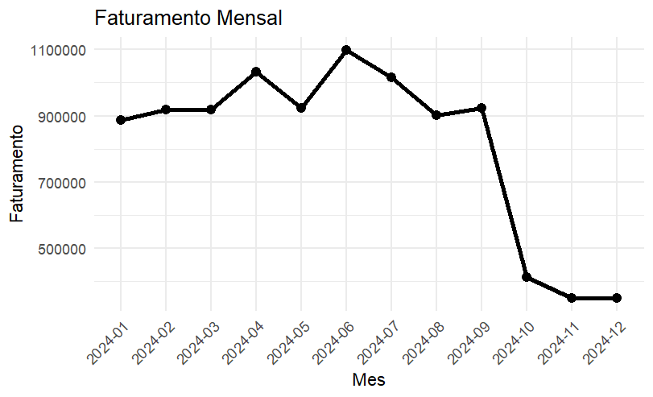
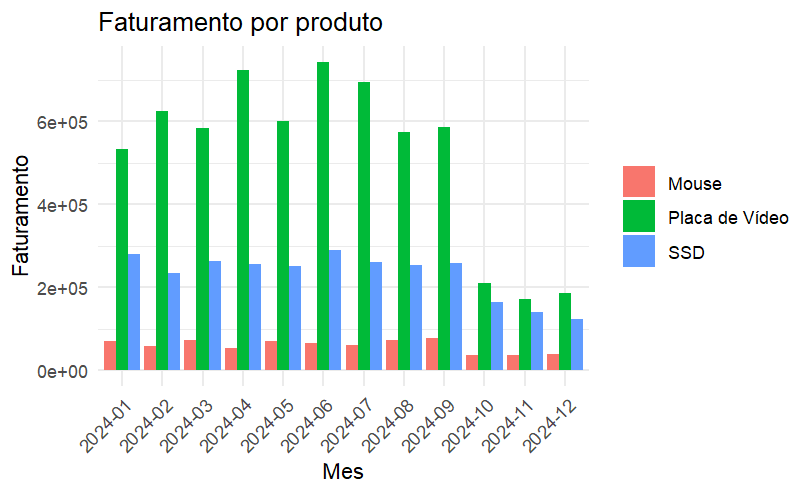

# 📊 HashTech Sales Analysis with R

## 🇺🇸 English

### 📌 Project Overview

This project was developed as the **final project of my self-taught RStudio learning journey**.

The objective was to analyze the sales data of a fictional company called **HashTech**, which sells three products:

- 🖥️ GPU (Graphics Card)
- 💾 SSD
- 🖱️ Mouse

The company noticed a **significant drop in revenue**, and the goal was to investigate the data to understand:

- When the revenue drop happened
- What changed in the sales pattern
- Possible hypotheses based on the data

This analysis was developed using **R and RStudio**, focusing on data manipulation and visualization.

---

## 📈 Data Analysis

The project analyzes sales data and generates visualizations such as:

### Monthly Revenue

This graph shows the **total revenue per month**, making it easier to identify when the revenue drop occurred.

---

### Revenue by Product

This visualization shows **how each product contributes to the total revenue**.

---

## 🧠 Concepts Learned During the Course

During my self-study of **R programming**, I learned and practiced the following concepts:

### R Fundamentals

- Variables
- Functions
- Vectors
- Matrices
- Factors
- Data Frames
- Lists

### Control Structures

- Conditional statements (`if`, `else`)
- Loops (`for`, `while`)

### Data Analysis Libraries

- `dplyr` → data manipulation
- `ggplot2` → data visualization
- `readr` → data import

---

## 🛠️ Technologies Used

- **R**
- **RStudio**

Libraries:

- `dplyr`
- `ggplot2`
- `readr`

